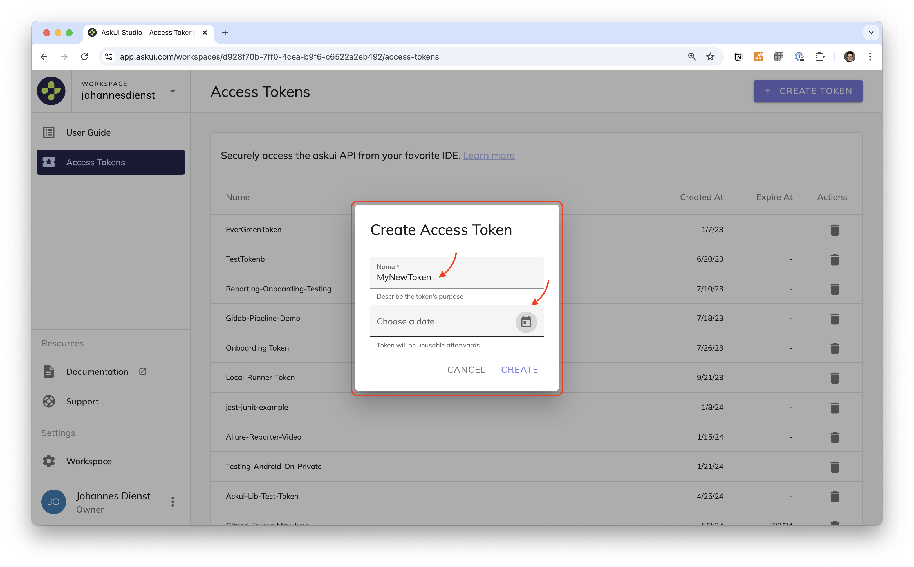

# Manage Access Tokens
To use AskUI you need to configure your credentials consisting of `workspace id` and `access token` in your [AskUI Development Environment](../suite/02-Components/AskUI-Development-Environment.md).

This page will show you how to create and delete access tokens.

## Create Access Token
Navigate to the page **Access Tokens** in [AskUI Studio](https://app.askui.com) and click the button **CREATE TOKEN** in the top right corner.

A dialogue will appear where you have to enter a name for the access token and an optional expiration date. If you leave the date empty the access token will never expire.

:::tip

For security reasons we recommend you set an expiration date for an access token.

:::

## Delete Access Token
To delete an access token click the `Trash Bin` icon in the same row. A confirmation dialogue will pop up where you can confirm the deletion.

:::danger

Access tokens get deleted immediately. There is no grace period!

:::

