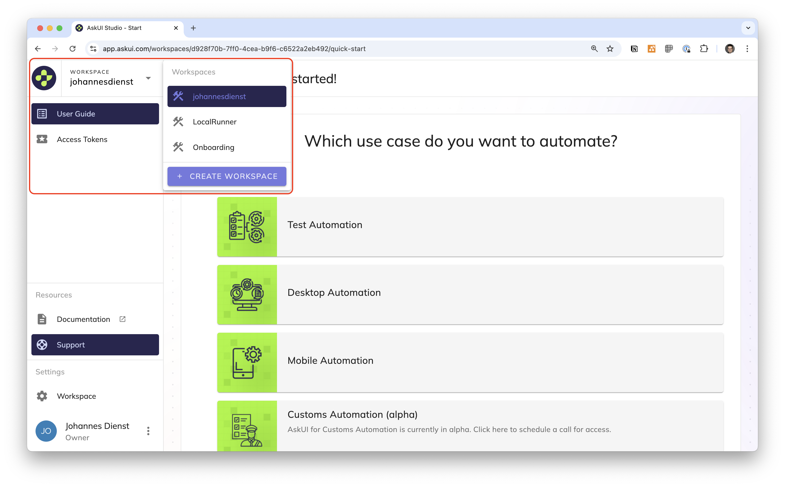
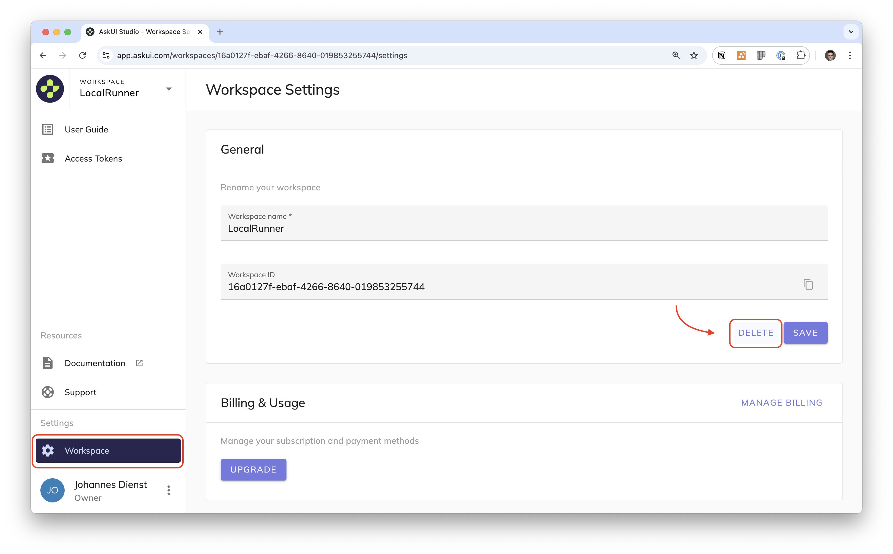

# Manage Workspaces
When you create an AskUI account one workspace will be created for you. Workspaces at the moment are merely a container for [access tokens](02-manage-access-tokens.md).

You can use them to seperate access tokens.

## Create New Workspace
The workspace you are currently in is displayed in the top-left corner. When you click the name a dropdown with all your workspaces for your account appears. You can create a new workspace by clicking on the button **CREATE WORKSPACE**.

## Change Workspace
The workspace you are currently in is displayed in the top-left corner. When you click the name a dropdown with all your workspaces for your account appears. You can change the workspace by clicking on a name.

## Delete Workspace
Navigate to the page **Workspace** in and click the button **DELETE** in the container **General**. A confirmation dialogue will pop up where you can confirm the deletion.

:::danger

Workspaces get deleted immediately including all the access tokens they contain. There is no grace period!

:::

