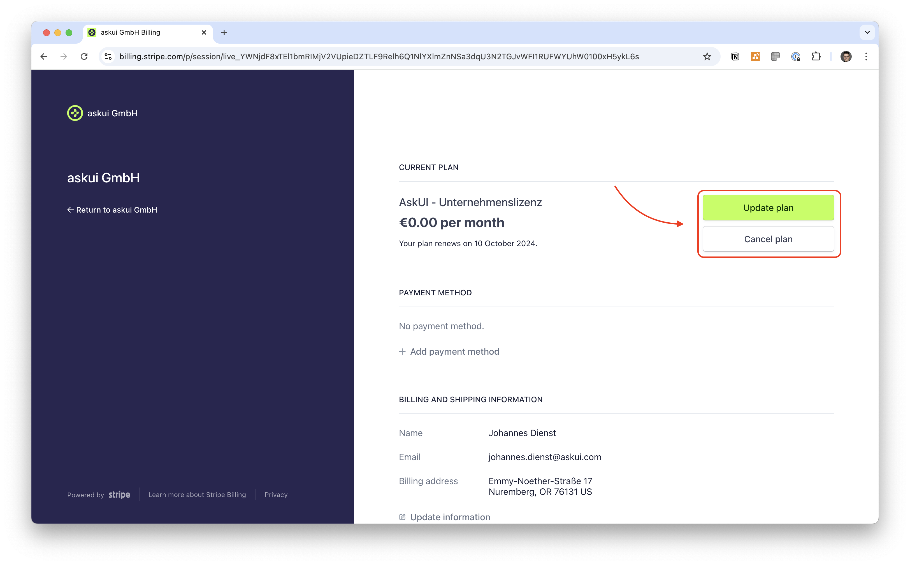

# Billing and Usage
Navigate to the page **Workspace** and click the button **UPGRADE** or the link **MANAGE BILLING** in the container **Billing & Usage**.
This will bring you to the **Billing Portal**.

## Add Payment Method
Navigate to the section **PAYMENT METHOD** and click **+ Add payment method**. You can choose either **(Credit) Card** or **SEPA Debit**. Enter the required information and click the button **Add**.

:::info

Depending on your payment provider you may have complete confirmation steps with them also.

:::

## Change Current Plan

:::info

You can only upgrade your plan to a paid version **after** you added a [Payment Method](#add-payment-method)! 

:::

Navigate to the section **CURRENT PLAN** and click **Update plan** to upgrade your plan or **Cancel plan**.

## Update Billing and Shipping Information
Your billing and shipping information will be used to create [Invoices](#view-and-download-invoices). Click on the **Update Information** link in the section **BILLING AND SHIPPING INFORMATION**. After you entered your information click the **Save** button at the end of the page.

## View and Download Invoices
Navigate to the section **INVOICE HISTORY**, click the row of the invoice you want to download. This will take you to a page where you can download the receipt and/or the invoice.

