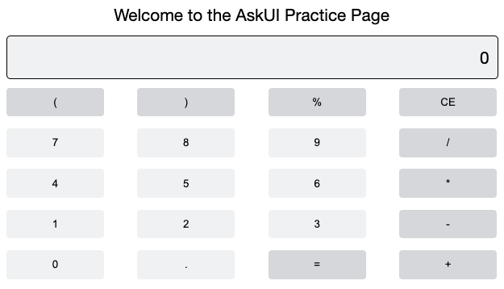

import Tabs from '@theme/Tabs';
import TabItem from '@theme/TabItem';

# Create Your First Instruction

:::tip
What you will learn

- Understanding AskUI Workflow files
- Creating and running your first automation
- How to select Elements that are not recognized
:::

## Prerequisites
- AskUI is installed on your computer.
- The AskUI Controller is running.
- We recommend using a second monitor to ensure AskUI is not interacting with your code editor.
- You have a workflow file open on your main display e.g. the original template `askui_example/my-first-askui-test-suite.test.ts` in the directory you initialized your AskUI-Project before.

:::info
**For macOS Users**  
Some users have reported instability running AskUI on macOS with external displays and/or [virtual desktops (called Spaces)](https://support.apple.com/en-gb/guide/mac-help/mh14112/mac). If you experience similar issues, please disconnect external displays and close virtual desktops.
:::

## Anatomy of an AskUI Workflow File
An AskUI Workflow file, using the Jest framework, is a versatile tool for automating user interface (UI) interactions across various applications, extending beyond traditional testing scenarios. It allows users to script complex UI interactions for both automation tasks and testing purposes.

### Key Components
**Import Statements**: Begin by importing necessary AskUI modules and helpers.

**`describe` Block**: Groups related UI automation scenarios or tests.

**`it` Blocks**: Each block defines a specific UI interaction or automation task, such as form submissions, navigation, or simulating user actions.

**AskUI API**: Utilized within it blocks for direct UI interactions, like clicking, typing, or navigating.
<!-- vale off -->
**Execution Instructions**: Commands provided for running the automated tasks or tests through the terminal.
<!-- vale on -->

### Example

```typescript showLineNumbers
import { aui } from './helpers/askui-helper';

describe('AskUI Automation Scenarios', () => {
  it('executes a specific task', async () => {
    await aui.click().text("Button Name").exec();
    // Additional automation logic
  });

  // More it blocks for different scenarios
});
```

## Step-by-Step Implementation With Example
We will automate the [Google Calculator](https://www.google.com/search?q=calculator) in this example to show you all the different techniques. Feel free to follow along. Our goal is to type `2.5+1` by clicking the buttons and then get the result by clicking `=`.



:::tip
You will learn:

- How to see and get element descriptions from an annotated screen
- Use different element-selectors
- Select elements that were not recognized by AskUI at first

:::


### Step 1: Annotate Your Screen
The interactive annotation serves as the first step in automating UI interactions. It's a process where the tool captures a snapshot of the user interface and identifies all interactive elements like buttons, textfields, and other controls.

By generating an annotated HTML file, you create a 'map' of the UI, which is crucial for accurately targeting and interacting with specific elements in subsequent steps.

<Tabs>
  <TabItem value="windows" label="Windows" default>

```typescript title="askui_example/my-first-askui-test-suite.test.ts" showLineNumbers
import { aui } from './helpers/askui-helper';

describe('AskUI on Windows', () => {
  it('should generate an HTML annotation', async () => {
    await aui.annotate();
  });
});
```
:::info
**Windows Bug**  
The interactive annotation `aui.annotateInteractively()` currently leads to an error on Windows. Instead use `annotate()` as outlined in the code above.
:::
  </TabItem>
  <TabItem value="macos" label="MacOS">

```typescript title="askui_example/my-first-askui-test-suite.test.ts" showLineNumbers
import { aui } from './helpers/askui-helper';

describe('AskUI on MacOS', () => {
  it('should generate an interactive annotation', async () => {
    await aui.annotateInteractively();
  });
});
```
  </TabItem>
  <TabItem value="linux" label="Linux">

```typescript title="askui_example/my-first-askui-test-suite.test.ts" showLineNumbers
import { aui } from './helpers/askui-helper';

describe('AskUI on Linux', () => {
  it('should generate an interactive annotation', async () => {
    await aui.annotateInteractively();
  });
});
```
  </TabItem>
</Tabs>

#### Run the Annotation

To execute the instructions, enter into your terminal (Windows: [AskUI Development Environment (ADE)](../02-Components/AskUI-Development-Environment.md)).

<Tabs>
  <TabItem value="windows" label="Windows" default>
  Switch into ADE by running `askui-shell` in a Command Prompt first.
  ```shell
  AskUI-RunProject
  ```
  </TabItem>
  <TabItem value="macOS" label="macOS" default>
  ```shell
  npm run askui
  ```
  </TabItem>
  <TabItem value="linux" label="Linux" default>
  ```shell
  npm run askui
  ```
  </TabItem>
</Tabs>

A few seconds later an (interactive) annotation will be generated. If you have used the `annotate()` command, the annotation files are saved under `<project_root>/report`.

Your (interactive) annotation looks like this (cropped version to show only the calculator):


To close out the interactive annotation, use `CMD/CTRL + W` or `ESC`.

If you’d like a deeper explanation as to what an (interactive) annotation is, read about it here. [Explanation of (Interactive) Annotations](../03-Element%20Selection/annotations-and-screenshots.md)

### Step 2: Identifying and Interacting with Your Target Element
This step is about pinpointing the exact UI element (like a button or link) you want to interact with. The element's properties (e.g. element-description) acts like a unique identifier for each UI component.

:::info

**Standard Element-Description (Recommended)**

- **Process**: Click the UI element during annotation to copy its description to your clipboard.
- **Advantages**: Quick for reliably identifiable elements.
- **Best Used When**: The element is distinctly recognizable and not surrounded by similar elements.

:::

First hover over the button containing the `2` and do a left mouse click. You now have the element-description in your clipboard.


To interact with the element you also need an `action`. We want to `click` the button so we add a `click() to the instruction as you can see in the following code. Check our [API Documentation](https://docs.askui.com/docs/0.11.6/api/API/table-of-contents#actions) for all the actions.

```typescript title="askui_example/my-first-askui-test-suite.test.ts" showLineNumbers
it('should click on my element', async () => {
  await aui
    .click() // your action
    .button() // your element description
    .exec();
});
```

As you can see AskUI tries to click a `button()` but it does not know _which one_ yet. We need to add more information like, for example that the button contains the text `2`. Add it by using `contains().text('2')`:

```typescript title="askui_example/my-first-askui-test-suite.test.ts" showLineNumbers
it('should click on my element', async () => {
  await aui
    .click() // your action
    .button().contains().text('2') // your element description
    .exec();
});
```

:::tip
You can freely go to [Step 4: Executing an Instruction](#step-4-execute-an-instruction) before you finished the whole example to see how your workflow runs before you are finished.
:::

Now you run into a problem that somehow `.` is not detected as a text and you have a lot of buttons already. So targeting the button with `.` only by specifying a button will not work. But you can use relational selectors for this.

:::info

**Using Relational Selectors**

- **Process**: Chain multiple element descriptions together using commands like `leftOf()`, `above()`, etc., to create a unique selector based on element relationships. More information can be found in the [AskUI documentation](https://docs.askui.com/docs/0.11.6/general/Element%20Selection/relational-selectors).
- **Advantages**: Increases selector specificity, particularly useful in complex UIs with numerous similar elements.
- **Best Used When**: Targeting elements in a densely populated UI or when elements lack unique identifiers.

:::

We will target the `.`-button by selecting it in _relation_ to another button that is recognized. We already know that the `2`-button works. So we instruct AskUI to click the button `below` the `2`-button:


```typescript
await aui.click()
         .button() // This is your target
         .below() // This is your relation
         .button().contains().text('2') // This is your anchor
         .exec();
```

After you entered `5` and `+` as described [at the start of step 2](#step-2-identifying-and-interacting-with-your-target-element) you realize that `1` is neither recognized as text, nor is the button containing it recognized at all. AskUI offers image-in-image with search `customElement()` for this scenario.

:::info

**Custom Element-Descriptions**

- **Process**: Use a screenshot snippet of the desired element to locate its exact position on the screen. More information can be found in the [AskUI documentation](../03-Element%20Selection/custom-elements.md).
- **Advantages**: Highly accurate for unique or custom-designed elements.
- **Best Used When**: The element has a distinct visual appearance.
- **Considerations**: This method is sometimes sensitive to screen resolution changes; ensure consistency in the automation/testing environment.

:::

Do the following to select the `1`-button:

1. Create a new folder `custom_elements` in your AskUI Project. Then 
2. Crop out the `1`-button from your screen like this with a snipping tool: 
3. Save it with the name `text1.clickable.button.png` in `custom_elements`

```bash
project_root/
├─ askui_example/
├─ node_modules/
├─ custom_elements/
  ├─ text1.clickable.button.png
├─ .eslintignore
├─ .eslintrc.json
├─ package.json
├─ tsconfig.json
```

```typescript
  await aui
    .click()
    .customElement({
      customImage: './custom_elements/text1.clickable.button.png',
    })
    .exec();
```

### Step 4: Execute an Instruction

Comment out the annotation instruction: Use `xit` to ignore the annotation instruction in future runs.
The final version should look like this:

```typescript title="askui_example/my-first-askui-test-suite.test.ts" showLineNumbers
describe('jest with askui', () => {

  xit('should generate an annotation', async () => {
    await aui.annotate(); // your inactive annotation
  });

  it('should click on my element', async () => {
    await aui.click().button().contains().text('2').exec();
    await aui.click()
        .button() // This is your target
        .below()
        .button().contains().text('2') // This is your anchor
        .exec();
    await aui
        .click()
        .customElement({
          customImage: './custom_elements/text1.clickable.button.png',
        })
        .exec();

    // The attentive reader might notice that the last step
    // is missing: You should know how that works now.
    // If you need help visit https://community.askui.com/forums/home
  });
});
```

As before, run the code in your terminal:
- Windows: Enter ADE and run `AskUI-RunProject`.
- macOS/Linux: Run `npm run askui`.

You should see AskUI take over your mouse, mouse over the elements you chose and click.

Congratulations! You’ve just built your first automation using AskUI. :tada:
