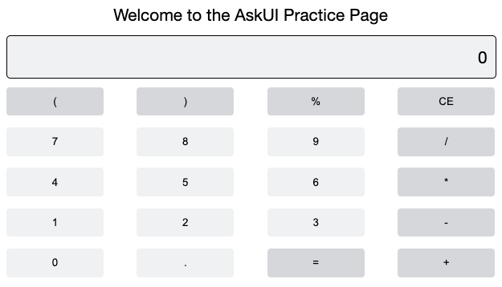
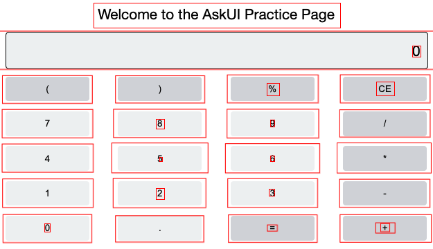

import Tabs from '@theme/Tabs';
import TabItem from '@theme/TabItem';

# Create Your First Instruction

:::tip
What you will learn

- Understanding AskUI Workflow files
- Creating and running your first automation
- How to select Elements that are not recognized
:::

## Prerequisites
- AskUI is installed on your computer.
- _Only Windows:_ The AskUI Controller is running.
- We recommend using a second monitor to ensure AskUI is not interacting with your code editor.
- You have a workflow file open on your main display, for example the original template `askui_example/my-first-askui-test-suite.test.ts`, in the directory you initialized your AskUI-Project before.

:::info
**For macOS Users**  
Some users have reported instability running AskUI on macOS with external displays and/or [virtual desktops (called Spaces)](https://support.apple.com/en-gb/guide/mac-help/mh14112/mac). If you experience similar issues, please disconnect external displays and close virtual desktops.
:::

## Anatomy of an AskUI Workflow File
An AskUI Workflow file is a tool for automating user interface (UI) interactions across various applications.

### Annotated Example with Key Components

```typescript showLineNumbers
// Import Statements: Begin by importing necessary AskUI modules and helpers.
import { aui } from './helpers/askui-helper';

// describe Block: Groups related UI automation scenarios or tests.
describe('AskUI Automation Scenarios', () => {

  // it Blocks: Each block defines a specific UI interaction 
  // or automation task, such as form submissions, navigation,
  // or simulating user actions.
  it('executes a specific task', async () => {

    // AskUI Instructions: Commands provided for running the automated
    // tasks or tests through the terminal.
    await aui.click().text("Button Name").exec();

    // Additional automation logic
  });

  // More it blocks for different scenarios
});
```

## Step-by-Step Implementation With Example
You will automate a [web calculator](https://askui.github.io/askui-practice-page) in this example to show you all the different techniques. Feel free to follow along. Our goal is to type `2.6+2` by clicking the buttons and then get the result by clicking `=`.



:::tip
You will learn:

- How to see and get element-descriptions from an annotated screen
- Use different element-selectors
- Select elements that were not recognized by AskUI at first

:::

---

### Step 1: Annotate Your Screen
The (interactive) annotation serves as the first step in automating UI interactions. It's a process where the tool captures a snapshot of the user interface and identifies all interactive elements like buttons, textfields, and other controls.

<Tabs>
  <TabItem value="windows" label="Windows" default>

```typescript title="askui_example/my-first-askui-test-suite.test.ts" showLineNumbers
...
  it('should generate an HTML annotation', async () => {
    await aui.annotate();
  });
...
```
  </TabItem>
  <TabItem value="macos" label="MacOS">

```typescript title="askui_example/my-first-askui-test-suite.test.ts" showLineNumbers
...
  it('should generate an interactive annotation', async () => {
    await aui.annotateInteractively();
  });
...
```
  </TabItem>
  <TabItem value="linux" label="Linux">

```typescript title="askui_example/my-first-askui-test-suite.test.ts" showLineNumbers
...
  it('should generate an interactive annotation', async () => {
    await aui.annotateInteractively();
  });
...
```
  </TabItem>
</Tabs>

---

#### Step 1.1: Run the Annotation

To execute the instruction:

```shell
AskUI-RunProject
```

A few seconds later an (interactive) annotation will be generated. If you have used the `annotate()` command, the annotation files are saved under `<project_root>/report`.

Your (interactive) annotation looks something like this:



:::warning

Your annotation may look differently and some red bounding boxes could be missing as AskUI detects elements visually. This means the detection is dependent on your screen resolution and settings! You will learn how to deal with this in a moment. 

:::

To close the interactive annotation, use `CMD/CTRL + W` or `ESC`.

If you’d like a deeper explanation as to what an (interactive) annotation is, read about it here. [Explanation of (Interactive) Annotations](../03-Element%20Selection/annotations-and-screenshots.md)

## Next Step: Interact with Elements
Now that we know which elements you can target the next step is to interact with a real element.

[Please go to the next page to learn how to do that!](write-your-first-instruction-part-two.md)
