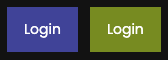
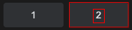

# Custom Elements

:::tip

We have a powerful replacement of *Custom Elements*: [Please use AI Elements](aielement.md).

:::

With **Custom Elements**, you can define a custom element-description based on how the element is displayed on the screen. This can be particularly useful in situations where standard element-descriptions are unreliable due to the non-standard properties of the element:


* Two elements only differ stably in color:


* Unknown icons or logos


* Very low contrast where detection fails:


* ...

This page will explain step-by-step how to create a **Custom Element** and also how to structure your workflows, so they remain maintainable.

## Understanding the `customElement()` in AskUI
`customElement()` is an element to look for on the screen that is defined by the user with a given screenshot of that element. The following code shows the usage of a `customElement()` by clicking a custom element that looks like the element in the file `logo.png`.

```ts
await aui
    .click()
    .customElement({
        customImage: './logo.png', // required
        name: 'myLogo', // optional
        threshold: 0.9, // optional, defaults to 0.9
        rotationDegreePerStep: 0, // optional, defaults to 0
        imageCompareFormat: 'grayscale', // optional, defaults to 'grayscale'
    })
    .exec();
```

Arguments:
- **customImage** (*`string`, required*):
    - A cropped image in the form of a base64 string or file path.
- **name** (*`string`, optional*):
    - A unique name that can be used for filtering for the custom element.
- **threshold** (*`number`, optional*):
    - A threshold for how much a UI element needs to be similar to the custom element as defined. Takes values between `0.0` (== all elements are recognized as the custom element which is probably not what you want) and `1.0` (== elements need to look exactly like the `customImage` which is unlikely to be achieved as even minor differences count). Defaults to `0.9`.
- **rotationDegreePerStep** (*`number`, optional*):
    - Step size in rotation degree. Rotates the custom image by this step size until 360° is exceeded. The range is from `0` to `360`. Defaults to `0`.
- **imageCompareFormat** (*`'RGB' | 'grayscale'`, optional*):
    - The color compare style. `grayscale` compares the brightness of each pixel whereas `RGB` compares all three color. `grayscale` is faster in execution, but `RGB` is generally more accurate, both in sensitivity and specificity. Defaults to `grayscale`.

## Step-By-Step Guide
Now that you know how to click a custom element you will create one on your own step-by-step.

You will move your mouse cursor to a little human-figure  as shown in the video below.

<video controls>
  <source src="https://d2dnep8p8ldagm.cloudfront.net/assets/docs/blog_customElement_askui_google_street_view.mp4"/>
</video>

### 0. Create a Folder for Your Custom Elements
We recommend to create a folder `custom_elements` in project's directory to store all the screenshots for custom elements (See also the section [Recommended Structure and Naming](#recommended-structure-and-naming)).

```bash
project_root/
├─ askui_example/
├─ node_modules/
├─ custom_elements/
├─ .eslintignore
├─ .eslintrc.json
├─ package.json
├─ tsconfig.json
```

### 1. Create a Screenshot of the Element
You can use your favorite _Snipping_ tool for this. Our recommendations for the different operating systems are as follows:

* Open the [Windows Snipping Tool (Win 7, 10, 11)](https://support.microsoft.com/en-us/windows/use-snipping-tool-to-capture-screenshots-00246869-1843-655f-f220-97299b865f6b)
  * Select *Rectangle* as area
  * You will be asked to select a certain portion of the screen
  * The captured image will be stored in the clipboard, save it to `custom_elements` folder.

* macOS: Press `cmd` + `shift` + `5`
  * Adjust the area to only enclose your custom element
  * Select the `custom_elements` folder under `Options - Save to`

* Linux: [Shutter](https://shutter-project.org/)

:::tip
The quality of the __crop-out__ plays a big role in how good the element will be recognized. Make sure to:

* Save it as a __PNG__ to avoid artifacts from compression
* Crop it out as tight as possible. At best with no pixel space on the borders.
:::

### 2. Save It in Your AskUI Project Folder
Save the image in your project's directory folder `custom_elements` with the name `human-figure.png`.

```bash
project_root/
├─ askui_example/
├─ node_modules/
├─ custom_elements/
  ├─ human-figure.png
├─ .eslintignore
├─ .eslintrc.json
├─ package.json
├─ tsconfig.json
```

### 3. Write the Code
Finally you can move the mouse cursor to the custom element.

```typescript
// move the mouse to the custom element
await aui.moveMouseTo()
    .customElement({
        customImage: "./custom_elements/human-figure.png",
        name: "street-view-icon",
        threshold: 0.9,
    })
    .exec();
```

## Recommended Structure and Naming
When you have more than a few custom elements you want to think about the correct folder structure of your AskUI project and a naming scheme for each custom element. This ensures maintainability of your project.

### AskUI Project Structure
The custom elements screenshots should not clutter your `root` folder of your AskUI project. Create a `custom_elements` folder to store all your screenshots.

If you have many workflows with custom elements only used in specific workflows, you can think about creating subfolders for each workflow as shown in the example below:

```bash
project_root/
├─ askui_example/
├─ node_modules/
├─ custom_elements/
  ├─ workflow1/
     ├─ lastname.form.textfield.png # path: ./custom_elements/workflow1/lastname.form.textfield.png
     ├─ ...
  ├─ workflow2/
  ├─ ...
├─ .eslintignore
├─ .eslintrc.json
├─ package.json
├─ tsconfig.json
├─ human-figure.png
```

:::tip
There is no _one-size-fits-all_ structure. If you develop workflows for different operating systems (OS) you may also want to create folders for each OS.
:::

### Screenshot Naming Scheme
It is also a good idea to create a naming scheme for screenshots. This will ensure that you can update them easier later.

A proven scheme is: `free-description.function.class.png`

For example for a `textfield` with the label `lastname` that is embedded in a form this gives you: `lastname.form.textfield.png`.

## Two Things to be Aware of When Using `customElement()`

**1) Create the Custom Image by Cropping it From The Actual Screen**

- To find a matching element from the screen, the custom image **must be very similar as it is displayed on the screen.**

<!-- vale off -->
**2) The Time of the Execution may Increase by a Notable Amount**
<!-- vale on -->

- In some cases using a `customElement()` increases the runtime by a notable amount. Therefore, if the task could be accomplished with other element-descriptions such as `icon()`, `button()`, or `text()`, then it may be better to avoid using the `customElement()`.
