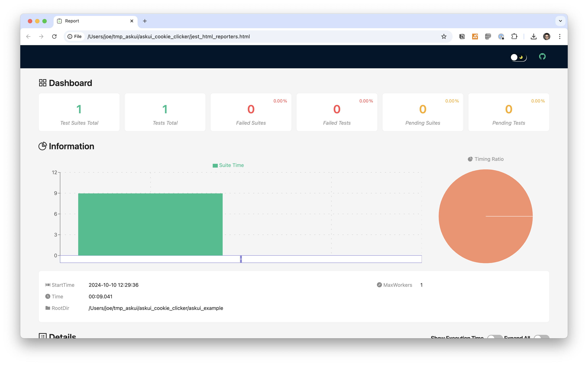

# AskUIJestHtmlStepReporter

The `AskUIJestHtmlStepReporter` generates a HTML report with optional before and after screenshots. It is saved in your project's root folder in the file `jest-html-reporters-attach`.



:::tip
Please read the [Getting started with reporting first](reporting.md).
:::

:::info
Due to restrictions of `jest-html-reporters` you can either have screenshots or video with this reporter but not both at the same time. For screenshots omit the `beforeEach()` and `afterEach()` hooks in `jest.setup.ts`. For video do not configure a `reporter` in your `UiControlClient`.
:::

## Install `ffmpeg` On Your System
To use this reporter you have to have [ffmpeg](http://www.ffmpeg.org/) installed on your system (including all necessary encoding libraries like `libmp3lame` or `libx264`).

Please follow the [installation instructions](http://www.ffmpeg.org/download.html) for your system.

## Enable Reporter in `jest.setup.ts`

Add the reporter to the `UiControlClient` in `jest.setup.ts`:

```typescript
// Do not forget this import at the start of the file!
import { AskUIJestHtmlStepReporter } from "@askui/askui-reporters";
...
  aui = await UiControlClient.build({
    reporter: new AskUIJestHtmlStepReporter({
      withScreenshots: 'always' as const, // See below for possible values
      withDetectedElements: 'always' as const, // See below for possible values
    })
  });
...
```

You can pass a `ReporterConfig` object to the reporter to configure the level of detail for screenshots and detected elements:

* onFailure (Default for both)
* required
* begin
* always

## Configure `beforeEach()` and `afterEach()` in `jest.setup.ts`

```typescript
import path from "path";
import { AskUIJestHtmlStepReporter } from "@askui/askui-reporters";

beforeEach(async () => {
  await aui.startVideoRecording();
});

afterEach(async () => {
  await aui.stopVideoRecording();
  const video = await aui.readVideoRecording();
  await AskUIJestHtmlStepReporter.attachVideo(video);
});
```

## Enable the Jest-Html-Reporters in `jest.config.ts`

Install `jest-html-reporters` environment:

```bash
npm install --save-dev jest-html-reporters
```

```typescript
import type { Config } from "@jest/types";

const config: Config.InitialOptions = {
  preset: "ts-jest",
  testEnvironment: "node",
  setupFilesAfterEnv: ["./helper/jest.setup.ts"],
  sandboxInjectedGlobals: ["Math"],
  reporters: ["default", "jest-html-reporters"],
};

// eslint-disable-next-line import/no-default-export
export default config;
```
