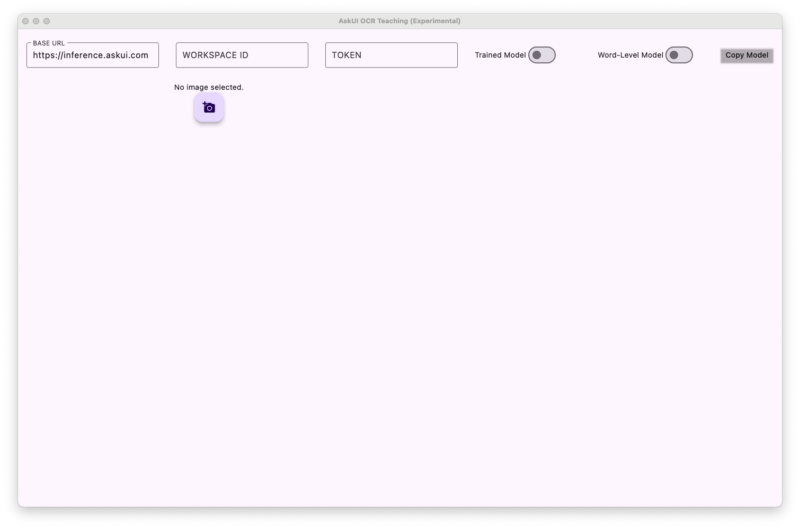
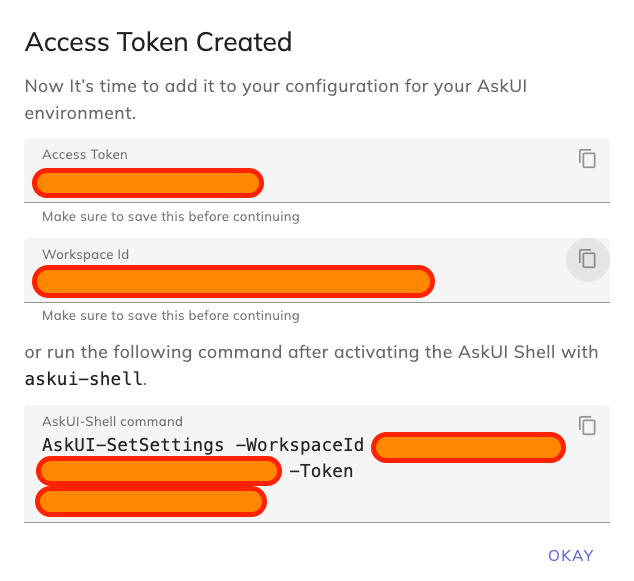
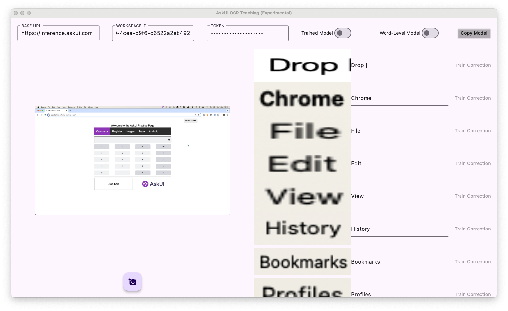
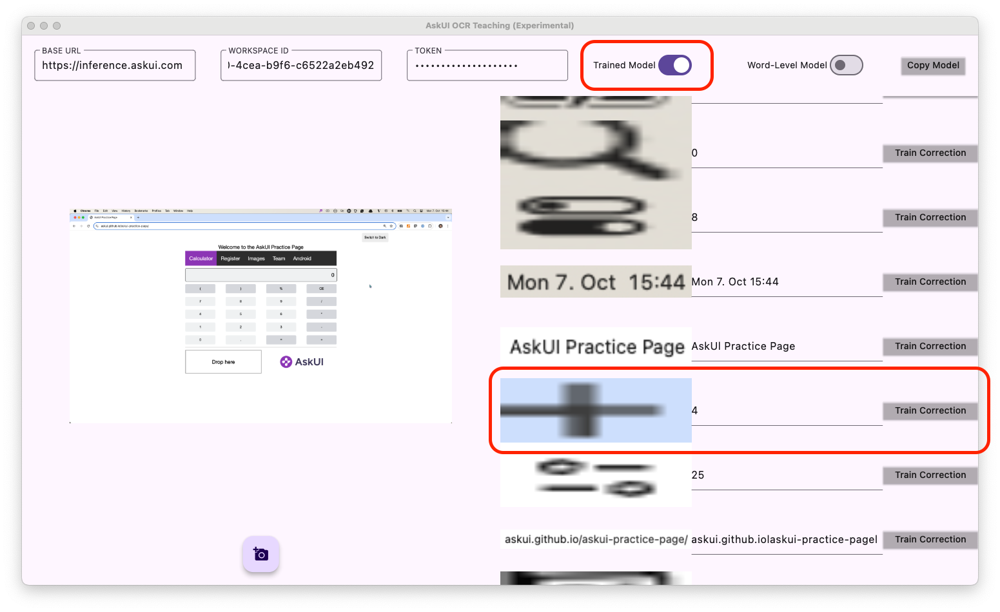

# AskUI OCR Teaching

:::note
Enable the *AskUI Development Environment* as described in [AskUI Development Environment](../../suite/02-Components/AskUI-Development-Environment.md) and then activate the experimental commands by running `AskUI-ImportExperimentalCommands` in your terminal.
:::

:::info
The app will be installed by default. You can choose not to install it by unchecking the checkbox. After installation, a shortcut named `AskUI OCR Teaching (Experimental)` will be added.
:::

This command launches the **AskUI OCR Teaching** application:

```powershell
# Import experimental commands.
AskUI-ImportExperimentalCommands

# Launch the OCR Teaching app.
AskUI-StartOCRTeaching
```

This will bring up the following window:



## Step 1: Enter Credentials
The model you finetune gets saved into your workspace. Create a new access token for security reasons in [AskUI Studio under Access Tokens](https://app.askui.com). You can then copy the workspace id and the access token to the **AskUI OCR Teaching** application



## Step 2: Create a Screenshot for Retraining
Next, choose a snipping tool of your choice and create a screenshot of the entire screen with the **text**-elements that were not recognized correctly. Save it as *PNG*.

## Step 3: Import the Screenshot for Retraining
Import the screenshot into **AskUI OCR Teaching** application by clicking the camera icon. It should look like this:



## Step 4: Retrain Wrongly Recognized Text Elements
First enable the switch **Trained Model**, so you can retrain our default model.

:::info

Why not switch on **Word-Level Model** as well? This is for special problems:

Take a label consisting of two words **Full Name** for example. The `space` may be problematic if you want to match with the instruction `.withText('Full Name')`. AskUI always matches on *sentence-level* which means that **Full Name** should be recognized correctly even when the model detects two elements **Full** and **Name**. Training on *word-level* allows you to correct errors on single words, **Ful** instead of **Full** for example.

:::

On the right half you can scroll through all the text elements that were recognized by AskUI and check if they are correct. Once you find one you can correct it and click **Train Correction** on the right. This will trigger a retraining which may take a few seconds. After it completed the text should refresh and be correct.

:::note

Sometimes you need more than one retraining for the model to adapt. In this case retrain again until the element gets recognized correctly.

:::



## Step 5: Copy Model Configuration to Your Askui-Project
Once you are happy with all the recognized elements, you can export the model by clicking **Copy Model**.

Head over to your AskUI Project and open the file `helpers/askui-helper.ts`. There add a new property `modelComposition` to the UiControlClient like this:

```typescript
...
  aui = await UiControlClient.build({
    ...
    modelComposition: [
      <Here goes your model composition>,
      // This is important!
      // Otherwise only text will be detected.
      {"task":"od","architecture":"yolo","version":"6","interface":"c9","useCase":"default","tags":[]}
    ]
  });
...
```

:::info

You may wonder how you can repeat the retraining or if it is final. The model gets saved in your workspace. When you open the **AskUI OCR Teaching** application the same model will be retrained.

:::
